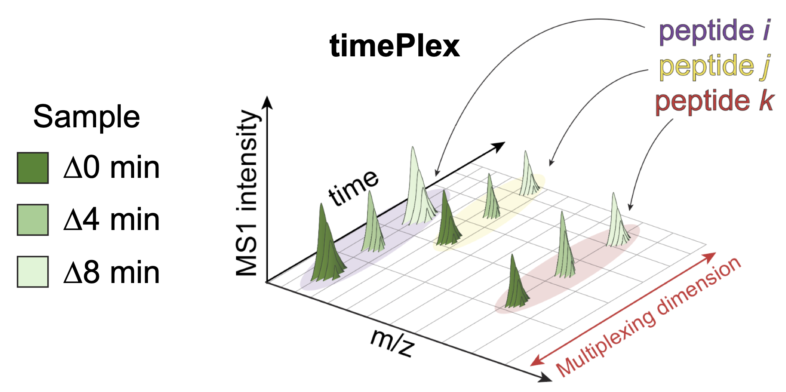

## Article: [Increasing mass spectrometry throughput using time-encoded sample multiplexing (Derks et al, 2025)](https://www.biorxiv.org/content/10.1101/2025.05.22.655515v1)

 


This work demonstrates an approach to multiplex samples for proteomic analysis using temporal encoding, which we refer to as 'timePlex'. This entailed the development of experimental implementations to stagger and overlap chromatography from multiple samples, and computational analyses to deconvolve the temporal-encoding as integrated as a module in [JMod](https://github.com/ParallelSquared/jmod). Experiments were performed to benchmark proteomic coverage and quantitative accuracy of this new 'timePlex' data type to established methods (LF non-multiplexed DIA and plexDIA). Combinatorial multiplexing of 9-plexDIA and 3-timePlex enabled 27-plex data acquisition, achieving throughput of 500 samples/day with 25 minutes of active chromatography per sample.

 

<h2 style="letter-spacing: 2px; font-size: 26px;" id="RAW-data">

Methods:

</h2>

#### Bulk data:

Proteomics methods: [plexDIA](https://scp.slavovlab.net/plexDIA) & [timePlex](https://www.parallelsq.org/timePlex)<br>

#### Single-cell data:

Proteomics methods: [plexDIA](https://scp.slavovlab.net/plexDIA) & [timePlex](https://www.parallelsq.org/timePlex)<br>

Sample preparation method: [nPOP](https://scp.slavovlab.net/nPOP)<br>  

<h2 style="letter-spacing: 2px; font-size: 26px;" id="plexDIA-data">

Data:

</h2>

All raw and processed data from the [article](https://www.biorxiv.org/content/10.1101/2025.05.22.655515v1) are organized in this MassIVE repository: [MSV000097736](https://massive.ucsd.edu/ProteoSAFe/dataset.jsp?task=7193ea0d007741c680f22ec005718e2b).

 

<h2 style="letter-spacing: 2px; font-size: 26px;" id="code">

Code:

</h2>

[JMod](https://github.com/ParallelSquared/jmod) was used for searching all data. A step-by-step guide from raw files to search results is given [below](#searching-with-jmod).

The [{targets} R package](https://books.ropensci.org/targets/) was used to ensure repeatability of our downstream analyses. R scripts corresponding to benchmarking and single-cell analyses can be found in the ["Data Analysis" folder of our GitHub](https://github.com/ParallelSquared/timePlex/tree/main/Data_analysis). The raw data, processed data, libraries, and meta data required to repeat these analyses can be found at our MassIVE repository: [MSV000097736](https://massive.ucsd.edu/ProteoSAFe/dataset.jsp?task=7193ea0d007741c680f22ec005718e2b)

Code used to create RT prediction models for label-free (LF) and mTRAQ-labeled peptides and for transfer learning can be found in the ["iRT_prediction" folder of our GitHub](https://github.com/ParallelSquared/timePlex/tree/main/iRT_prediction). The files required to regenerate the analyses and model-creation (Files_to_repeat_RT_prediction_and_TransferLearning.zip) are also available for download from our MassIVE repository: [MSV000097736](https://massive.ucsd.edu/ProteoSAFe/dataset.jsp?task=7193ea0d007741c680f22ec005718e2b)

 

<h2 style="letter-spacing: 2px; font-size: 26px;" id="searching-with-jmod">

Searching data with JMod:

</h2>

The workflow is: **Thermo `.raw` → centroided `.mzML` (MSConvert) → JMod search (command line)**.

#### 1. Install JMod

JMod uses the [uv](https://docs.astral.sh/uv/) package manager (`pip install uv` if you don't have it). From a terminal:

```bash
git clone https://github.com/ParallelSquared/jmod.git
cd jmod
uv sync --python 3.11
source .venv/bin/activate
```

On Windows, activate the environment with `.venv\Scripts\activate` instead. See the [JMod README](https://github.com/ParallelSquared/jmod) for more installation options, including a GUI.

#### 2. Convert `.raw` files to `.mzML` with MSConvert

JMod reads `.mzML` files, and the spectra must be **centroided**. Convert with MSConvert from [ProteoWizard](https://proteowizard.sourceforge.io/download.html).

**MSConvert GUI:**

1. Add the `.raw` file(s) and set **Output format** to `mzML`.
2. Under **Filters**, choose **Peak Picking**, set **Algorithm** to `Vendor` and **MS Levels** to `1-`, then click **Add**. `1-` means "MS level 1 and up", so both MS1 and MS2 spectra are centroided.
3. Make sure Peak Picking is the **first** filter in the list, because vendor peak picking must run on the unmodified vendor data.
4. Click **Start**.

**MSConvert command line** (equivalent):

```bash
msconvert JD0413.raw --mzML --filter "peakPicking vendor msLevel=1-" -o mzML/
```

#### 3. Get a spectral library

JMod takes a spectral library as a `.tsv` in DIA-NN library format (the required columns are shown in JMod's example library, `data/filtered_library.tsv`). The libraries used in the article are in the MassIVE repository: [MSV000097736](https://massive.ucsd.edu/ProteoSAFe/dataset.jsp?task=7193ea0d007741c680f22ec005718e2b).

#### 4. Run the search

The example below searches one mTRAQ 3-plexDIA × 3-timePlex run (9 samples in one injection):

```bash
python path/to/jmod/run_jmod.py -l path/to/DIANNv1p9_JD0504_506_mTRAQ_HY_jmod.tsv -i path/to/JD0413_re.mzML --iso --num_iso 2 --lib_frac 0.2 --timeplex --num_timeplex 3 --no_ms1_req --atleast_m 2 --plexDIA --tag mTRAQ
```

You can run it with `uv run python ...` instead if you haven't activated the environment. To search several files, run the command once per `.mzML`.

**What each option does**

| Option | What it does | Default | Used in example |
|---|---|---|---|
| `-i`, `--mzml` | Centroided `.mzML` file to search. | required | `JD0413_re.mzML` |
| `-l`, `--speclib` | Spectral library (`.tsv`, DIA-NN format). | required | mTRAQ library |
| `--timeplex` | **timePlex mode.** Treats the run as several staggered, overlapping LC separations. Each time channel gets its own RT alignment and search window, and identifications are reported per time channel (`time_channel` column). | off | on |
| `--num_timeplex` | Number of time channels (staggered sample loads) in the run. Must match how the data was acquired. | 0 | `3` |
| `--plexDIA` | **plexDIA mode.** Precursor q-values are combined across the label channels of a plexDIA set (`BestChannel_Qvalue`), so a precursor confidently identified in one channel is also reported in its sibling channels. Use together with `--tag`. | off | on |
| `--tag` | Mass tag used to label the samples. JMod expands every library precursor into one entry per channel of that tag. The name must match a tag defined in JMod's `src/MassTags/`, e.g. `mTRAQ` (Δ0/Δ4/Δ8), `PSMtag_9plex`, `diethyl_3plex`. Leave unset for label-free data. | `None` (label-free) | `mTRAQ` |
| `--iso` | Model MS2 fragment isotopes. Each library fragment is expanded into its isotopic peaks, and those peaks are fit jointly with the observed spectrum. | off | on |
| `--num_iso` | Number of isotopic peaks per fragment when `--iso` is on (2 = monoisotopic + M+1). | 2 | `2` |
| `--lib_frac` | Candidate pre-filter. A precursor is only fit in a scan if its matched fragments account for more than this fraction of its total library fragment intensity. Lower values let more candidates through, which is more sensitive but slower. | 0.5 | `0.2` |
| `-m`, `--atleast_m` | Candidate pre-filter. A precursor must match **more than** this many of its top-10 library fragments, so `--atleast_m 2` requires at least 3 matches. | 3 | `2` |
| `--no_ms1_req` | Don't require a matching MS1 precursor peak for a candidate to be considered. By default, an MS1 peak is required. | MS1 required | MS1 not required |

**Other useful options**

| Option | What it does | Default |
|---|---|---|
| `-o`, `--output_folder` | Folder for the results. If omitted, a `<mzML name>_results` folder is created next to the `.mzML`. If that folder already exists, a timestamp is appended so earlier results are never overwritten. | next to the `.mzML` |
| `-p`, `--ppm` | MS2 fragment m/z tolerance (ppm). | 10 |
| `--ms1_ppm` | MS1 m/z tolerance (ppm). `0` means JMod estimates it from the data. | 0 (estimated) |
| `--user_rt_tol` with `--rt_tol` | Force a fixed RT tolerance (in minutes, set by `--rt_tol`) instead of the one JMod learns from the data. | off / 0.5 |
| `-t`, `--threads` | Number of CPU threads. | 10 |
| `--config_json` | Load all parameters from a JSON file. Every search writes its configuration to `outputs/config.json`, so a search can be repeated exactly with `--config_json path/to/outputs/config.json`. | — |

**Adapting the example to other experiment types in this article**

| Experiment | Change to the example command |
|---|---|
| Label-free DIA (no multiplexing) | Remove `--timeplex --num_timeplex 3 --plexDIA --tag mTRAQ` and use an LF library. |
| Label-free timePlex | Remove `--plexDIA --tag mTRAQ` and use an LF library. |
| plexDIA only | Remove `--timeplex --num_timeplex 3`. |
| Other plexDIA tags (e.g. 9-plex) | Set `--tag` to the matching tag in `src/MassTags/` and use the matching library. |

Boolean options (`--iso`, `--timeplex`, `--plexDIA`, `--no_ms1_req`, …) are switches and take no value. To confirm a run used the parameters you intended, check the `Namespace(...)` line near the top of `Log.log`, which records the full configuration actually used.

#### 5. Outputs

Results are written to the `<mzML name>_results` folder:

- `filtered_IDs.csv`: target precursors passing 1% FDR (`BestChannel_Qvalue < 0.01`), with all columns.
- `filtered_IDs_parquet_columns.parquet`: the same IDs with a smaller set of key columns (sequence, charge, channel, `time_channel`, q-values, protein, and quantities).
- `outputs/all_IDs.csv`: all scored targets and decoys before FDR filtering.
- `Summary.txt`: precursor and protein ID counts per channel.
- `Log.log`: full log of the search, including any warnings or errors.
- `outputs/config.json`: the parameters used, reusable with `--config_json`.

A full description of the output columns is in the [JMod documentation](https://github.com/ParallelSquared/jmod).

 

 

 
