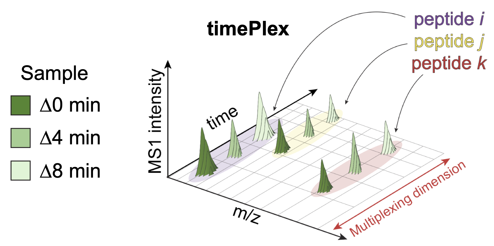

## Article: [Increasing mass spectrometry throughput using time-encoded sample multiplexing (Derks et al, 2025)](https://www.biorxiv.org/content/10.1101/2025.05.22.655515v1)

 

This work demonstrates an approach to multiplex samples for proteomic analysis using temporal encoding, which we refer to as 'timePlex'. This entailed the development of experimental implementations to stagger and overlap chromatography from multiple samples, and computational analyses to deconvolve the temporal-encoding as integrated as a module in [JMod](https://github.com/ParallelSquared/jmod). Experiments were performed to benchmark proteomic coverage and quantitative accuracy of this new 'timePlex' data type to established methods (LF non-multiplexed DIA and plexDIA). Combinatorial multiplexing of 9-plexDIA and 3-timePlex enabled 27-plex data acquisition, achieving throughput of 500 samples/day with 25 minutes of active chromatography per sample.

 

<h2 style="letter-spacing: 2px; font-size: 26px;" id="RAW-data">

Methods:

</h2>

#### Bulk data:

Proteomics methods: [plexDIA](https://scp.slavovlab.net/plexDIA) & [timePlex](https://www.parallelsq.org/technology-and-science/timePlex) 

#### Single-cell data:

Proteomics methods: [plexDIA](https://scp.slavovlab.net/plexDIA) & [timePlex](https://www.parallelsq.org/technology-and-science/timePlex) 

Sample preparation method: [nPOP](https://scp.slavovlab.net/nPOP)   

<h2 style="letter-spacing: 2px; font-size: 26px;" id="plexDIA-data">

Data:

</h2>

All raw and processed data from the [article](https://www.biorxiv.org/content/10.1101/2025.05.22.655515v1) are organized in this MassIVE repository: [MSV000097736](https://massive.ucsd.edu/ProteoSAFe/dataset.jsp?task=7193ea0d007741c680f22ec005718e2b).

 

<h2 style="letter-spacing: 2px; font-size: 26px;" id="code">

Code:

</h2>

[JMod](https://github.com/ParallelSquared/jmod) was used for searching all data.

The [{targets} R package](https://books.ropensci.org/targets/) was used to ensure repeatability of our downstream analyses. R scripts corresponding to benchmarking and single-cell analyses can be found in the ["Data Analysis" folder of our GitHub](https://github.com/ParallelSquared/timePlex/tree/main/Data_analysis). The raw data, processed data, libraries, and meta data required to repeat these analyses can be found at our MassIVE repository: [MSV000097736](https://massive.ucsd.edu/ProteoSAFe/dataset.jsp?task=7193ea0d007741c680f22ec005718e2b)

Code used to create RT prediction models for label-free (LF) and mTRAQ-labeled peptides and for transfer learning can be found in the ["iRT_prediction" folder of our GitHub](https://github.com/ParallelSquared/timePlex/tree/main/iRT_prediction). The files required to regenerate the analyses and model-creation (Files_to_repeat_RT_prediction_and_TransferLearning.zip) are also available for download from our MassIVE repository: [MSV000097736](https://massive.ucsd.edu/ProteoSAFe/dataset.jsp?task=7193ea0d007741c680f22ec005718e2b)

 

 

 
